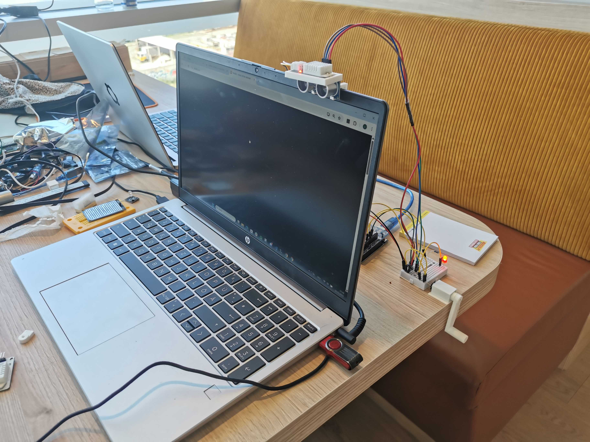

# The SAD (search annoyance department)

At the SAD, we specialize in making your usage of the internet as ~~bad~~ great as it possibly can be by creating the ~~worst~~ best extensions and hardware products you will ever need/use.

## Usage

Idk, figure it out urself or smth

To make it work, globaly disable CSP, the protection system, yes

## Fun facts

* The last ~2 hours of the project were spent debugging and trying to make the extension work again (we only got it working ~10 minutes before the deadline)

* The submission video was recorded in one take ~5 minutes before the submission deadline

## License

This project is licensed under the [MIT License](LICENSE).

This project was made in the 24-hour (2 day) hackathon, [Lisbon](https://scrapyard.pt) [scrapyard](https://scrapyard.hackclub.com) satellite event, by a team of 3 people that didn't know eachother before the event (perhaps without any sleep)